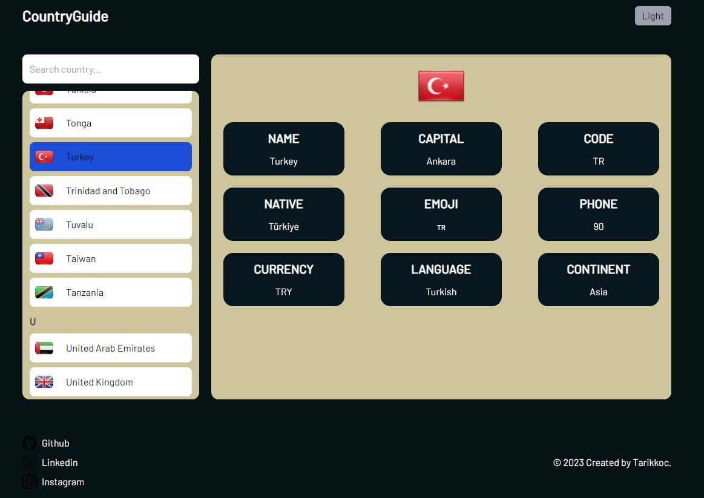
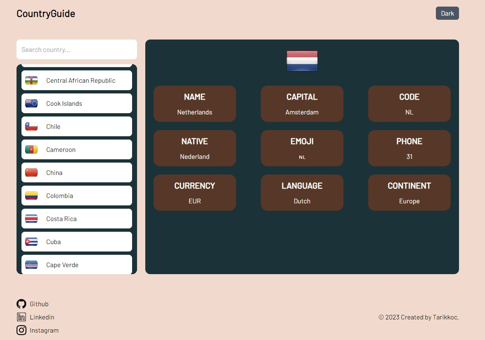
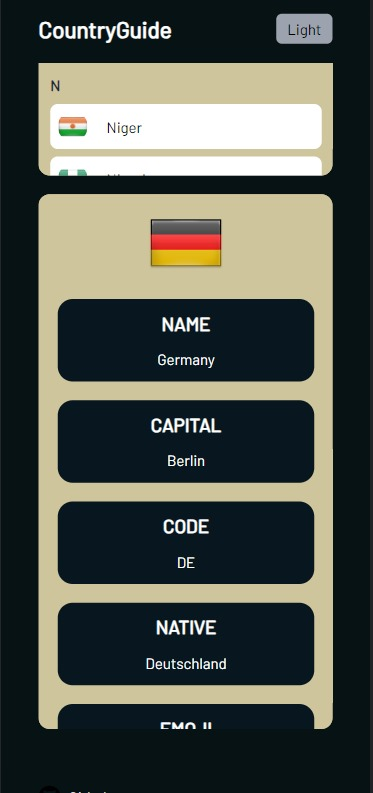
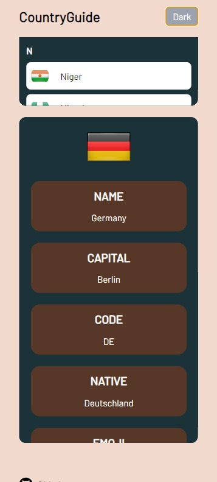

<h2>COUNTRY GUIDE</h2>

In this project, we accessed country information using GraphQL. The country flag and country name are designed and added like a phone directory on the left list. The details of the selected country are displayed on the right list. There's a search bar on the left list to filter the countries. The project has both dark and light themes. The project features a Responsive Design.

You can visit <a href="https://graphql-country-info.netlify.app">https://graphql-country-info.netlify.app</a>
<h2>SKILLS</h2>
<ul>
  <li>React</li>
  <li>Typescript</li>
  <li>GraphQl</li>
</ul>
<h2>USAGE</h2>

1. Fork the repo and then clone it or download it.

2.First install all dependencies:

  <storng>npm install</storng> (with npm)  
  <storng>yarn</storng> (or with yarn)

  

3. Start the server

npm start [OR] yarn start

  

4. Now run the app

localhost:[PORT]

<h3>Dark/Light</h3>
  
  
<h3>Search</h3>
  
<h3>Responsive</h3>
  
  

